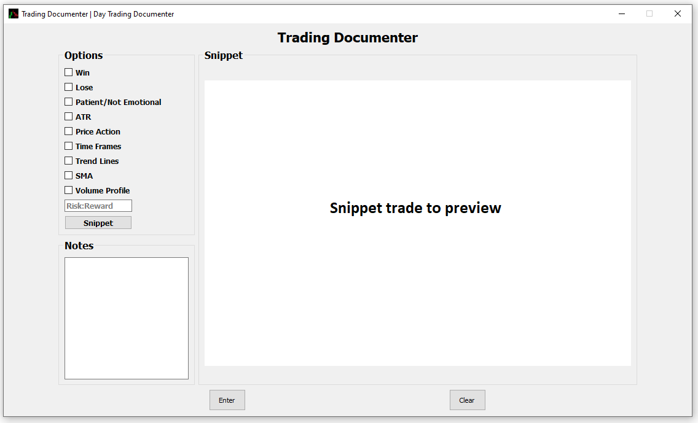

# trading-documenter
Trading documenter is a desktop GUI that allows the user to record trades they have made. It has a variety of options that allow the user to more easily record reasons why the user took a specific trade. This allows the user to refine their trading strategy with data from previous trades.

# Screenshot

# Installation
* Check out https://github.com/Kevin-C-Fang/trading-documenter/releases
* Download and Unzip the latest release and run executable to run application

# Features
* Checkbox options that easily record reasons why the trade was taken
* Note box for more detailed description.
* Takes snippet of trade session

# How to use?
TBD

# Dependencies
* PyQt5
* Pytest
* Pandas
* Openpyxl
* openpyxl_image_loader
* Pillow

# License
GPL-v3.0 
