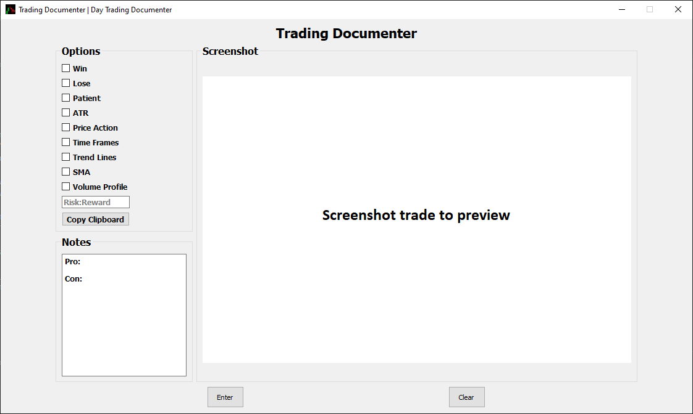

# trading-documenter
Trading documenter is a desktop GUI that allows the user to record trades they have made. It has a variety of options that allow the user to more easily record reasons why the user took a specific trade. This allows the user to refine their trading strategy with data from previous trades.

# Screenshot

# Installation
* Check out https://github.com/Kevin-C-Fang/trading-documenter/releases
* Download and Unzip the latest release and run executable to run application

# Features
* Checkbox options that easily record reasons why the trade was taken
* Note box for more detailed description.
* Saves snippet from clipboard

# How to use?
* Check whichever boxes that you followed for the current trade
* Press Windows + Shift + S and take snippet to save to clipboard
* Press Copy Clipboard button to save snippet
* Enter in notes for trade
* Press enter to automatically save data to folder in data/m-d-y
* Press clear to clear all entered in data and reset to blank fields

# Dependencies
* PyQt5
* Pytest
* Pandas
* Pillow
* openpyxl

# License
GPL-v3.0 
